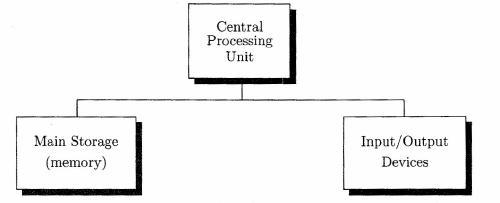

# 1.1 Introduction（介绍；序言）

A computer system can **be divided into**（被分成） two **main**（主要的） parts: **hardware**（硬件） and **software**（软件）.

The hardware **consists of**（由 ... 组成） all the **equipment**（设备） that **is involved in**（涉及到； 与 ... 有关联） **operating**（operate 操作） a computer.

The software consists of **set**s（集合；组合；一套；一副） of **instruction**s（指令）, called **program**s（程序）, that are used to tell the computer what **task**s（任务） it **is to**（be to = will） **perform**（执行）.

The **central**（中央的） **process**ing（处理） **unit**（单元；部件） (**CPU**（中央处理器）) is the heart of a computer. It **consists of** two **main** parts: a **control**（控制） **unit** and an **arithmetic**（算术；计算）-**logic**（逻辑） unit (ALU).

The control unit **interpret**s（解释） the **instructions** of the programs and **send**s（发送） **command**s（命令） to **various**（各种各样的） other parts of the computer **so that**（因此；以便） the **instructions** are **execute**d（执行）.

When **command**ed（指挥） by the **control unit**, the **arithmetic-logic unit** **perform**s **arithmetic** and makes very simple **logical**(符合逻辑的；逻辑上的；合理的) **decision**s（决定；决策） **such as**（例如；诸如） **determining**（determine 决定） **whether or not**(无论是 ... 或 ...； 是否) two **number**s（数量；数字） have the same **value**（值）. 

The **memory**（内存） of the computer is the part that **store**s（存储） both the **instructions** that the CPU **is to perform** and the **data**（数据） **on which**（which 代表 the data） these instructions **are to be performed**.

To **communicate with**（与 ... 交流） the world, each computer must have some **input**（输入） and **output**（输出） **device**s（设备）, **collectively**（总体地） **referred to as**（称为） I/O **devices**. A small computer may have only **a couple of**（两个或几个） **input devices** - a **keyboard**（键盘） and a **mouse**（鼠标）, and one **output device** - a **screen**（显示屏）.

As we have already noted, every computer system must have software **as well as**（也，还，并且） hardware before it can do any computing.

Each computer's CPU uses instructions **encode**d（编码） electronically in **memory**. This **code**（代码） is called, **reasonably**（合理地） enough, **machine code**（机器代码）.

**Although**（虽然） it is possible to write programs **directly**（直接地） in **machine code**, this **process**（过程） has **a number of**（许多；若干） **disadvantage**s（不利，不便）.

For these reasons, most **programming**（编程） is now done using **high-level languages**（高级语言）. **Programs** in these languages are **reasonably** easy to write, understand, and **modify**（修改）. There are many such high-level languages **in use**（正在被使用） today. **Java** is such a language.

A **program** written in a **high-level language** cannot be **perform**ed **directly** by the **hardware** of a computer. Instead, another program, usually called a **compiler**（编译器）, must be used to **translate**（翻译） the **high-level language** into **machine code**.

The **original**（原始的；最初的） program in the **high-level language** is called the **source program**（源程序） **while**（而） the **corresponding**（对应的） **machine code** is called the **object program**（目标程序）.

**Thus**（这样）, to have a computer **perform** the **instructions** of a program written in a **high-level language**, we must **go through**（经过） two **stage**s（阶段；步骤）:

1. **Compilation**（编译）: Here the **compiler** is **brought**（bring 的过去分词） into **memory** and its **instructions** are **perform**ed. The **instructions** of the compiler **cause**（引起；使发生） the computer to read the **source program** and **translate** it into the **corresponding object program**. 

2. **Execution**（执行）: The **machine code** instructions of the **object program** are **performed**.

## Exercise 1.1

1. Which part of a computer would **perform** each of the following **tasks**?
    
    (a) **add**（加） 2533 and 4178

    (b) **print**（打印） a **line**（行） of **text**（文本）
    
    (c) **determine** whether（是否） one **number** is **large**r（大） than a second **number**
    
    (d) **store** the **result**（结果） of a **calculation**（calculate 计算）
    
    (e) **send** an **item**（一件；一则；一条） from **memory** to an **output device**

2. Explain the **difference**（区别） between a **source program** and an **object program**.
