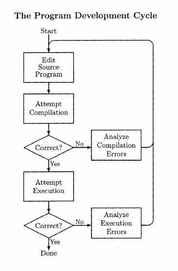

# 1.3 Developing Java Programs

There are **a number of**（许多；若干） **way**s（方式） to **create**（创建） and **run**（运行） a Java **program**（程序）. If you are working with Java **on your own**（独立地）, you **should**（应该） **feel free to**（可以随便） choose the one that **suits**（适合） you. If, as is more **likely**（可能的）, you are in a computer science course, your **instructor**（指导老师） may **specify**（指定） the **way** that the **local**（本地的） system **operate**s（操作）. **Assuming**（假定） that you are **free**（自由的） to **choose**（选择） a **program** **development**（开发） **environment**（环境）, here is a **brief**（简短的） **outline**（概述） of the **choice**s（选择） **available**（可得到的）.

**Almost**（几乎） everything that you will need to **develop**（开发） Java **programs** is **available**（可得到的） **for free**（免费） from Sun Microsystems, the **developer**s（开放者） of Java. To **obtain**（获得） a **copy**（拷贝） of Java from Sun, go to their web site at *http://java.sun.com* and **download**（下载） the Java 2 **Standard**（标准的） **Edition**（版；版本） (J2SE) **Software**（软件） **Development**（开发） **Kit**（成套工具；工具箱） (SDK) **appropriate**（适当的，合适的） for your computer's **operating system**（操作系统）. The SDK **contain**s（包含） **a variety of**（各种各样的） **tool**s（工具）, **including**（包括） a **compiler**（编译器）, an **interpreter**（解释器）, and the **Application**（应用） **Program**ming（编程） **Interface**（接口） (API) - a **huge**（巨大的） **library**（库） of **class**es（类） **contain**ing **method**s（方法） that you will be using in your programs. You may **want**（要；想要） the **latest**（最近的；最新的） **version**（版本） of the SDK but, if your **institution**（机构） is using an **earlier**（较早的） **one**（代替 version）, it is **probably**（或许；很可能） best to get that (to **be sure**（保证） that **programs** **develop**ed at home will also run when **mark**ed（打分） at school). To use the SDK **directly**（直接地）, we must **operate** in a **text-based**（基于文本的） **environment**, **without**（在没有...的情况下） using a **mouse**（鼠标）. We will **examine**（检查） the **details**（细节） of this **process**（过程） **shortly**（立刻；马上）.

As an **alternative**（供替代的选择）, there are many **versions** of **programs** called **Integrated**（集成的） **Development** **Environments** (IDE's) that **provide**（提供）, as the name **suggest**s（暗示；使想起；表明）, an **environment** that is **design**ed（设计） to **assist**（帮助） the **user**（用户） in **developing** Java **programs**. An IDE can help you in **organizing**（原形 organize， 组织） **file**s（文件）, writing **programs**, finding **mistake**s（错误） in **programs**, and **run**ning（运行） programs - using both a **mouse** and the **keyboard**（键盘）. Some IDE's **come complete with**（配有） all **tools** **necessary**（必要的） for program **development**（开发） **while**（而） **others**（其他的） **require**（要求；需要） that the SDK be **obtain**ed from Sun. Some are **free**（免费的）; others are **quite**（相当） **expensive**（贵）. If you are interested in using an IDE, a **search**（搜索） **engine**（引擎） on the web pointing to "Java IDE" will get you **a great deal of**（大量的） **information**（信息） **about**（关于） what is **currently**（当前） **available**.

To **start**（开始） the **development** of a **program**, you must first write the **source program**（源程序） using some **text editor**（文本编辑器）. If you are using an IDE, **then**（那么） this will be part of the IDE. **If not**（如果不是）, then you can use one of the **text editor**s **available** with your **operating system**. **As examples**（例如）, Windows has a text editor **called**（叫做） Notepad; UNIX **system**s（系统） have **a number of** editors, **including** pico, vi, and emacs; and X-Windows has nedit and xedit. It is better to use a text editor **rather than**（而不是） a **word processor**（文字处理器） **since**（因为） we want to **create** a **simple**（简单的） **text file**（文本文件） while **word processor**s **tend to**（倾向于） **produce**（产生） **files** that include **information** about **layout**（版面，布局）, **font**s（字体）, **and so on**（等等）. The **program** must be **save**d（保存） in a **file** with a name of the **form**（格式） (**Throughout**（在整个...） this book, **item**s（内容） **print**ed（打印） in a font **like**（像） this and **surround**ed（包围） by **angle bracket**s（尖括号） are used to **indicate**（表明；指明） **form**s. **Actual**（实际的） **value**s（值） are **obtain**ed by **substituting**（原形 substitute，用…替换） something of the **required**（要求的） **form**, **without**（不带） the **angle bracket**s. **Anything**（任何事；任何东西） not **contain**ed in **angle bracket**s should **appear**（显得） **exactly**（完全地） as shown.)

```
<name>.java
```

where `<name>` is **exactly** the same name that was used for the **class**. The `.java` part is called an **extension**(扩展名). **As an example**(例如), the **source file**(源文件) for a program **contain**ed in a **class** called `Sample` **should**(应该) be called `Sample.java` (with the **case of the letters**(
字母的大小写) **match**ing(相一致) **exactly**).

**Once**(一旦) the program has been written and **save**d, it must then be **compile**d(编译) into Java **byte code**(字节码). If you are working with an **IDE**(集成开发环境), then a **mouse** **click**(点击) should **invoke**(调用) the Java **compiler**. If you are working in a **command**(命令) **window**(窗口), the **compiler** can be **invoke**d for the **program** in the **file** called `Sample.java` by writing

```shell
   javac Sample.java
```

Before **convert**ing(转换) the program to **byte code**(字节码) **form**（格式）, the **compiler** first **tries to**(try to 试图) find **mistake**s in the program. It cannot find all **mistake**s but it is **quite**(相当) **clever**(聪明) and it can **detect**(发现) many of them. If **error**s(错误) are **detect**ed **during**(在...期间) **compilation**(compile 的名词形式), a **message**(消息) will be **print**ed and **compilation** will not be **complete**d(完成). If this **occur**s(发生), the **programmer**(程序员) must **analyze**(分析) the **problem**(问题), **correct**(改正) the **source code**(源代码), and **repeat**(重复) the **attempt**(尝试) to **compile** the program. With a **complex**(复杂的) program, this **process** may be **repeat**ed many times before a program **compile**s **without**(没有) **error**s.

**Once** the **compiler** is happy with the **form** of the program, it will **compile** it to **produce** a **byte code** **file** called `<name>.class`. **At this point**(这时), we must **call upon**(调用) the **Java Virtual Machine**(Java 虚拟机) (JVM) to **run**(运行) the program by **interpret**ing(解释) the **byte code** and **executing**(执行) the program's **instruction**s(指令). In an **IDE**, another **mouse** **click** should **allow**(允许) you to do this. In a **command window**, the **JVM** can be **invoke**d by writing

```shell
   java <name>
```

**As an example**, for the program **originally**(原来) **create**d in the **file** `Sample.java` and **compile**d into the file `Sample.class`, we would **run** the program by writing

```shell
   java Sample
```

**Notice**(注意) that there is no **extension** on the **file** name in this **command**.

**Even if**(即使) a program **compile**s **correctly**, it may not **run** correctly. If this is the **case**(情况), **then** **once again**(再一次) the problem must be **analyze**d and the program must be **correct**ed in the **editor**, **re-**compiled, and **re-**run. This **cycle**(周期), **sometimes**(有时) called the program **development** cycle, is **illustrate**d(作图解) in the next **diagram**(图表).



## Exercises 1.3

1. **Copy**(拷贝；复制) and **run** the program shown in Example 1 on page 6.

2. To get some **familiarity**(熟悉) with Java's **reaction**s(反应) to **mistake**s in a program, try **introducing**(引入) the **following**(下列的) **error**s (one **at a time**(每次)) in the program of **Question**(问题) 1 and then **attempt**ing to **compile** and **run** the **resulting**(结果的) program. **Note**(记录) the result in each **case**.

    a. Change `Greet` to `greet`.
    
    b. Change `main` to `Main`.

    c. Change `println` to `write`.

    d. Add a **semi-colon**(分号) after` args)`.
    
    e. **Omit**(省略) the **square bracket**s(方括号) after the word `String`.